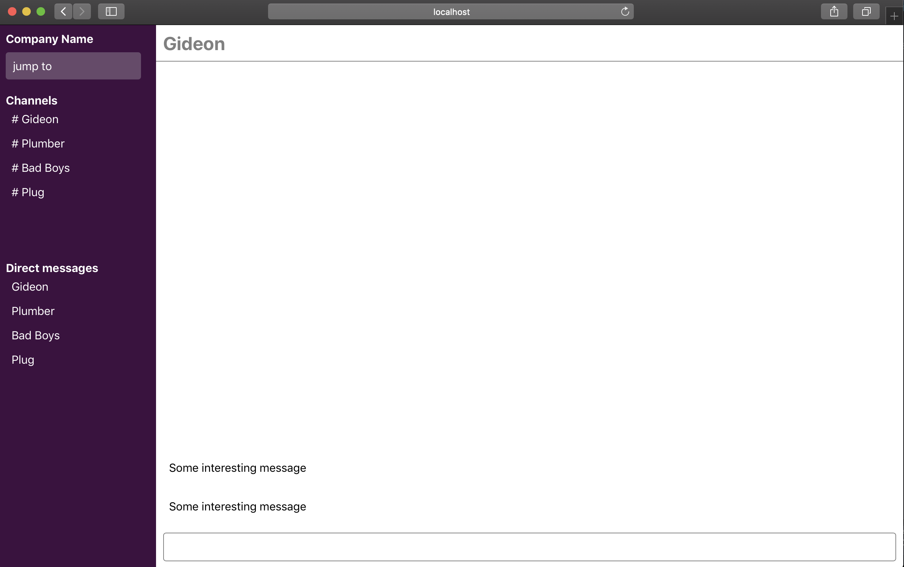

# Slack Clone (New Slack 😎)
This is project is a clone of [Slack](https://slack.com) - Slack is a cloud-based proprietary instant messaging platform developed by Slack Technologies.

## Built with
- [React](https://reactjs.org/)
- [Firebase](https://firebase.google.com/)
- [Redux](https://redux.js.org/)

## Set up

    $ git clone https://github.com/lytes20/SlackCloneReact.git
    $ cd SlackCloneReact
    $ yarn
    $ yarn start

## Adding firebase 🔥 to you react project
- See steps [here](docs/AddFireBase.md) on how you can add firebase to your React Project

## Screenshot
 
