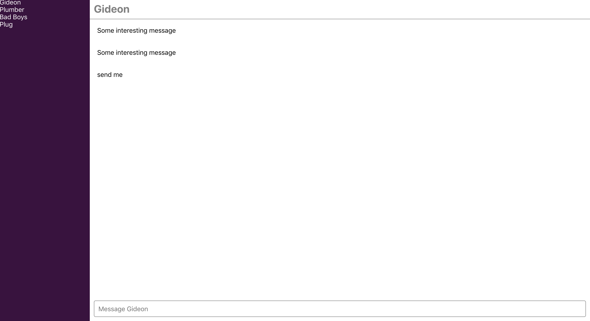

# Slack Clone
This is project is a clone of [Slack](https://slack.com) - Slack is a cloud-based proprietary instant messaging platform developed by Slack Technologies.

## Built with
- React
- Firebase
- Redux

## Set up

    $ git clone https://github.com/lytes20/SlackCloneReact.git
    $ cd SlackCloneReact
    $ yarn
    $ yarn start

## Screenshot
 
